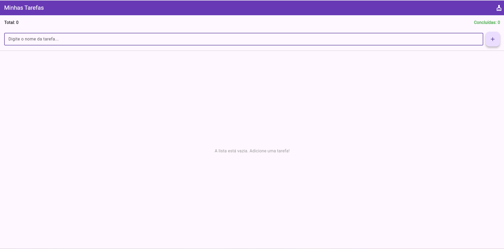
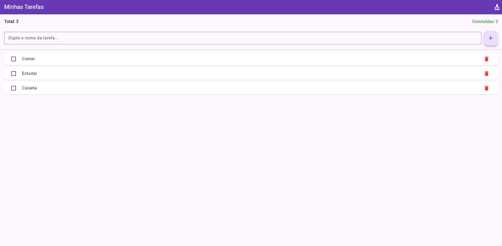
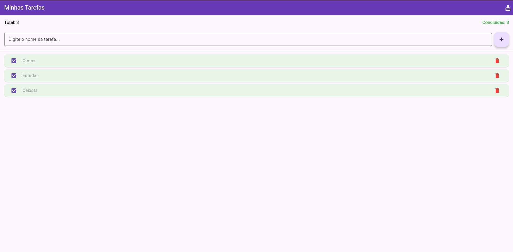

# App Lista de Tarefas (To-Do List)

Aplicativo desenvolvido em Flutter como atividade prática da disciplina de Desenvolvimento para Dispositivos Móveis. O objetivo principal do projeto é aplicar os conceitos de `StatefulWidget`, manipulação de estado com `setState()` e o ciclo de vida dos widgets.

**Nome:** Gabriel Godoy Motta  
**Turma:** 5ª Fase - Análise e Desenvolvimento de Sistemas (ADS) - Faculdade Senac Joinville

---

## Screenshots

| Lista Vazia | Com Tarefas Pendentes | Tarefas Concluídas |
| :---: | :---: | :---: |
|  |  |  |

---

## Funcionalidades Implementadas

### Obrigatórias:
- [x] **Adicionar Tarefas:** Campo de texto (`TextField`) com botão para inserir novas tarefas na lista, limpando o campo automaticamente após a inclusão.
- [x] **Exibir Lista:** Utilização de `ListView.builder` para renderizar a lista de tarefas. Exibe uma mensagem amigável quando a lista está vazia.
- [x] **Marcar como Concluída:** Utilização de `Checkbox`. Ao ser marcada, o texto da tarefa recebe um traço de riscado (`TextDecoration.lineThrough`).
- [x] **Remover Tarefas:** Botão com ícone de lixeira para remover permanentemente um item da lista.
- [x] **Requisitos Técnicos:** Uso de classe `Tarefa`, `List<Tarefa>`, `TextEditingController` (com método `dispose()` implementado) e controle de estado dinâmico com `setState()`.

### Extras (Bônus):
- [x] **Contador de Tarefas:** Exibe no topo da tela o total de tarefas criadas e o número de tarefas já concluídas.
- [x] **Feedback Visual (Cores):** Tarefas concluídas recebem um fundo levemente verde para destacar visualmente a conclusão.
- [x] **Limpar Concluídas:** Botão de "vassoura" na `AppBar` que remove todas as tarefas marcadas como concluídas de uma só vez.

---

## Instruções de Execução

1. Certifique-se de ter o [Flutter SDK](https://docs.flutter.dev/get-started/install) instalado.
2. Clone este repositório:
   ```bash
   git clone https://github.com/godoy220/Todo-List-Flutter-Gabriel_Godoy